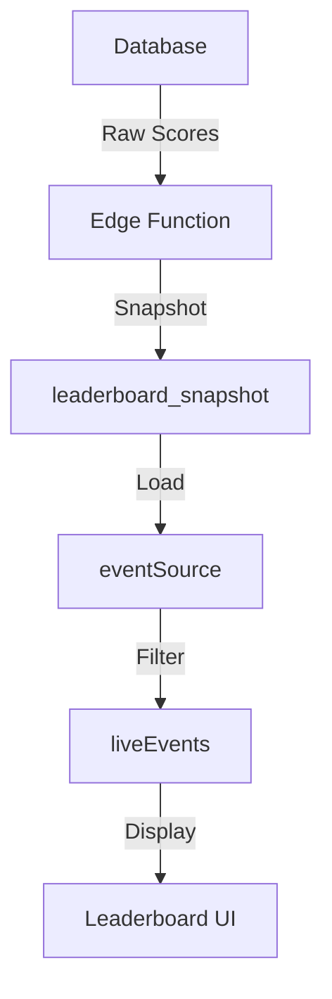

# THE-BRAIN Leaderboard System
> Version: 1.1 — Last Updated: 2024-03-19

## 🧠 What This Covers
This doc explains how the leaderboard system:
- Determines which events are shown
- Loads and filters data consistently
- Moves from raw Supabase calls → reactive stores
- Ensures correctness using shared status logic

## 🎯 Core Architecture

### 1. Event Management
```typescript
// src/lib/utils/eventUtils.ts
export async function getLiveVisibleEventsForOrg(orgId: string): Promise<Event[]>
```
- ✅ NEW: Centralized event filtering logic
- Uses `getEventStatus()` for live status
- Filters by `show_on_main_leaderboard`
- Counts scores for accurate status

### 2. Source Stores
```typescript
// src/lib/stores/eventSource.ts
export const eventSource = createEventSource();
export const liveEvents = derived(eventSource, $es =>
  $es.events.filter(e =>
    e.show_on_main_leaderboard &&
    getEventStatus(e, e.score_count ?? 0).isLive
  )
);
```
- ✅ NEW: Proper source store pattern
- Handles loading/error states
- Provides derived store for live events
- Follows THE-BRAIN architecture
- Methods:
  - `fetchEvents(orgId)`: Load events for org
  - `addEvent(event)`: Create new event
  - `updateEvent(id, updates)`: Modify event
  - `deleteEvent(id)`: Remove event

### 3. Event Status
```typescript
// src/lib/utils/eventStatus.ts
export function getEventStatus(event: Event, scoreCount: number = 0): EventStatus
```
- ✅ CURRENT: Still accurate and in use
- Returns: `{ code, label, isLive, color }`
- Used by `getLiveVisibleEventsForOrg`
- ⚠️ Requires `scoreCount` for accurate live status

## 🔄 Data Flow



## ⚠️ Outdated Information

1. **Event Source Store**
   - ❌ OLD: Direct Supabase calls in components
   - ✅ NEW: Use `eventSource.loadEvents(orgId)`

2. **Event Filtering**
   - ❌ OLD: Manual filtering in components
   - ✅ NEW: Use `getLiveVisibleEventsForOrg()`

3. **Live Events**
   - ❌ OLD: Direct filtering in components
   - ✅ NEW: Use `$liveEvents` derived store

## 🎯 Best Practices

1. **Event Loading**
```typescript
// ✅ DO
await eventSource.loadEvents(orgId);

// ❌ DON'T
const { data } = await supabase.from('events').select();
```

2. **Live Event Access**
```typescript
// ✅ DO
export const liveEvents = derived(eventSource, $es =>
  $es.events.filter(e =>
    e.show_on_main_leaderboard &&
    getEventStatus(e, e.score_count ?? 0).isLive
  )
);

// ❌ DON'T
$: liveEvents = events.filter(e => e.show_on_main_leaderboard);
```

3. **Error Handling**
```typescript
// ✅ DO
try {
  await eventSource.loadEvents(orgId);
} catch (err) {
  showToast('Unable to load events', 'error');
}

// ❌ DON'T
const { error } = await supabase.from('events').select();
if (error) console.error(error);
```

## 📦 File Structure

```
src/
├── lib/
│   ├── utils/
│   │   ├── eventUtils.ts      # ✅ NEW: Event filtering
│   │   └── eventStatus.ts     # ✅ CURRENT: Status logic
│   └── stores/
│       └── eventSource.ts     # ✅ NEW: Source store
```

## 🔄 Next Steps

1. **Real-time Updates**
   - Add Supabase subscriptions to `eventSource`
   - Handle score updates that affect event status
   - Update store when events change

2. **UI Integration**
   - Update leaderboard page to use `eventSource`
   - Add loading states using `$eventSource.loading`
   - Use `$liveEvents` for display

3. **Performance**
   - Consider caching frequently accessed events
   - Implement pagination for large event lists
   - Add request debouncing for rapid updates 